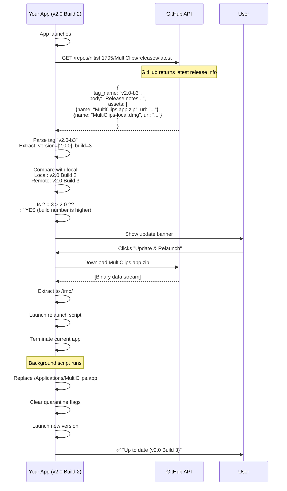

# 🔄 How MultiClips Auto-Update Works - Complete Explanation

## 📱 User Experience (What Users See)

```
User launches MultiClips
         ↓
[App checks GitHub in background]
         ↓
┌─────────────────────────────────────┐
│  🔔 New Version Available!          │
│  MultiClips v2.1 (Build 4)          │
│  (You have: v2.0 Build 2)           │
│                                     │
│  [View Changelog] [Update & Relaunch]│
└─────────────────────────────────────┘
         ↓
User clicks "Update & Relaunch"
         ↓
[Progress bar: Downloading... 87%]
         ↓
[App closes, update installs, app reopens]
         ↓
✅ "MultiClips is up to date (v2.1 Build 4)"
```

**That's it!** Users never touch GitHub, DMG files, or installers.

---

## 👨‍💻 Developer Workflow (What You Do)

### Step 1: Make Your Changes
```bash
# Fix bugs, add features, etc.
git add .
git commit -m "Fix clipboard bug"
```

### Step 2: Build Release
```bash
./build.sh

# This automatically:
# 1. Increments build number (2 → 3)
# 2. Compiles release binary
# 3. Creates MultiClips.app.zip  ← REQUIRED for auto-updater
# 4. Creates MultiClips-local.dmg  ← Optional for manual installs
```

### Step 3: Commit Build Number
```bash
git add MultiClips.xcodeproj/project.pbxproj
git commit -m "Release v2.0 Build 3"
git push origin main
```

### Step 4: Create GitHub Release
```bash
gh release create v2.0-b3 \
  --title "MultiClips v2.0 Build 3" \
  --notes "Bug fixes and improvements" \
  build/MultiClips.app.zip \
  build/MultiClips-local.dmg
```

**OR** via GitHub Web UI:
1. Go to https://github.com/nitish1705/MultiClips/releases
2. Click "Draft a new release"
3. Tag: `v2.0-b3`
4. Upload `build/MultiClips.app.zip` ⚠️ **REQUIRED**
5. Upload `build/MultiClips-local.dmg` (optional)
6. Publish

---

## 🔍 How the App Finds Updates (Technical Deep Dive)

### When Does It Check?

1. **On App Launch** (automatic, background)
2. **Manual Check** (user clicks "Check for Updates" in About section)

### The Update Detection Process



---

## 📡 The GitHub API Call (Actual HTTP Request)

When your app checks for updates, it makes this API call:

```bash
# Endpoint
GET https://api.github.com/repos/nitish1705/MultiClips/releases/latest

# Headers
Accept: application/vnd.github.v3+json
User-Agent: MultiClips-App/2.0
```

### GitHub's Response (Example)

```json
{
  "id": 123456789,
  "tag_name": "v2.0-b3",
  "name": "MultiClips v2.0 Build 3",
  "body": "## What's New\n- Fixed clipboard bug\n- Improved performance",
  "html_url": "https://github.com/nitish1705/MultiClips/releases/tag/v2.0-b3",
  "published_at": "2026-08-03T10:30:00Z",
  "assets": [
    {
      "id": 987654321,
      "name": "MultiClips.app.zip",
      "browser_download_url": "https://github.com/.../MultiClips.app.zip",
      "size": 15728640
    },
    {
      "id": 987654322,
      "name": "MultiClips-local.dmg",
      "browser_download_url": "https://github.com/.../MultiClips-local.dmg",
      "size": 20971520
    }
  ]
}
```

---

## 🧮 Version Comparison Logic (Step-by-Step)

### Example: User has v2.0 Build 2, GitHub has v2.0-b3

```swift
// 1. App reads its own version
let localVersion = "2.0"           // from CFBundleShortVersionString
let localBuild = 2                 // from CFBundleVersion

// 2. App fetches GitHub release
let githubTag = "v2.0-b3"          // from API response

// 3. Parse the tag
parseReleaseVersion(tag: "v2.0-b3", body: nil)
  ↓
  cleanTag = "2.0-b3"              // Remove 'v'
  ↓
  Regex: ^([0-9\.]+)[-_\+](?:b|build)?\s*([0-9]+)$
  ↓
  Match found!
  - Group 1: "2.0" → versionStr = "2.0"
  - Group 2: "3" → buildNum = 3
  ↓
  normalizeVersion("2.0")
  ↓
  Result: [2, 0, 0]                // Array of integers
  
// 4. Create AppVersionInfo objects
local  = AppVersionInfo(versionComponents: [2,0,0], buildNumber: 2)
remote = AppVersionInfo(versionComponents: [2,0,0], buildNumber: 3)

// 5. Compare versions component by component
isUpdateNewer(remote: remote, local: local)
  ↓
  Compare version arrays:
    remote[0] (2) vs local[0] (2) → Equal, continue
    remote[1] (0) vs local[1] (0) → Equal, continue
    remote[2] (0) vs local[2] (0) → Equal, check build
  ↓
  Compare build numbers:
    remote.build (3) > local.build (2) → TRUE
  ↓
  Result: ✅ UPDATE AVAILABLE

// 6. Show update notification to user
updateAvailable = true
latestRelease = githubReleaseData
```

---

## 🎯 Different Tag Format Examples

Your app supports multiple tag formats. Here's how each is parsed:

### Format 1: Tag with Build Suffix (Recommended)

```
GitHub Tag: v2.0-b3

Parsing:
- Clean: "2.0-b3"
- Regex matches: version="2.0", build="3"
- Result: v2.0.0 (Build 3) ✅
```

### Format 2: Plus Separator

```
GitHub Tag: v2.0+3

Parsing:
- Clean: "2.0+3"
- Regex matches: version="2.0", build="3"
- Result: v2.0.0 (Build 3) ✅
```

### Format 3: Build in Release Body

```
GitHub Tag: v2.0
Release Body: "Bug fixes\n\nBuild: 3"

Parsing:
- Clean tag: "2.0"
- Regex on tag: No build found
- Search body: "Build: 3" found!
- Result: v2.0.0 (Build 3) ✅
```

### Format 4: Simple Tag (Build defaults to 1)

```
GitHub Tag: v2.1.0
Release Body: "New features"

Parsing:
- Clean: "2.1.0"
- Regex: No build suffix
- Body: No build number
- Default: build = 1
- Result: v2.1.0 (Build 1) ✅
```

---

## 🔐 Security & Self-Replacement

### How the App Replaces Itself

```bash
# 1. Download zip to temporary directory
/tmp/MultiClips-update-ABC123/MultiClips.app.zip

# 2. Extract with ditto (preserves all attributes)
ditto -x -k MultiClips.app.zip /tmp/.../

# 3. Create relaunch shell script
#!/bin/bash
sleep 1  # Wait for app to quit
rm -rf "/Applications/MultiClips.app"  # Remove old
cp -R "/tmp/.../MultiClips.app" "/Applications/"  # Copy new
xattr -dr com.apple.quarantine "/Applications/MultiClips.app"  # Clear Gatekeeper flag
open "/Applications/MultiClips.app"  # Launch new version

# 4. Make script executable
chmod +x relaunch.sh

# 5. Run script in background
bash relaunch.sh &

# 6. Current app terminates
NSApp.terminate(nil)
```

### Why This Works

- ✅ macOS allows apps to replace themselves in `/Applications/`
- ✅ `xattr -dr com.apple.quarantine` removes Gatekeeper warnings
- ✅ Background script runs independently of the app
- ✅ User sees seamless transition (app closes, updates, reopens)

---

## ⚠️ Important: The .zip File is REQUIRED

### Why ZIP and not DMG?

| File Type | Auto-Updater | Manual Install |
|-----------|--------------|----------------|
| **MultiClips.app.zip** | ✅ **REQUIRED** | ❌ Not used |
| **MultiClips-local.dmg** | ❌ Not used | ✅ Optional |

**Reason:** 
- ZIP files can be extracted programmatically with `ditto`
- DMG files require mounting, which is complex and requires user interaction
- The updater specifically looks for `.zip` files in GitHub releases

### What Happens If You Only Upload DMG?

```
User has: v2.0 Build 2
GitHub has: v2.1.0 with ONLY .dmg file

App checks GitHub → Finds v2.1.0 release
App looks for .zip asset → NOT FOUND ❌
App opens GitHub release page in browser
User has to manually download and install ⚠️
```

**Solution:** Always upload **both** files:
```bash
gh release create v2.1.0 \
  build/MultiClips.app.zip \    # For auto-updater
  build/MultiClips-local.dmg    # For new users
```

---

## 🧪 Testing Your Update System

### Test 1: Verify App Detects Updates

```bash
# Current app: v2.0 Build 2
# Latest GitHub: v2.1.0

# Open app → Should show update banner
# OR click "Check for Updates" in About section
```

### Test 2: Simulate Update Check

```bash
# Make API call manually
curl -s https://api.github.com/repos/nitish1705/MultiClips/releases/latest \
  | jq '{tag_name, assets: [.assets[].name]}'

# Should return:
{
  "tag_name": "v.2.1.0",
  "assets": [
    "MultiClips-local.dmg",
    "MultiClips.app.zip"
  ]
}
```

### Test 3: Run Unit Tests

```bash
swift test_update_logic.swift

# Expected:
# ✅ Total Tests: 13
# ✅ Passed: 13
```

---

## 🐛 Troubleshooting

### Problem: Users Not Seeing Update

**Check 1: Is MultiClips.app.zip in the release?**
```bash
gh release view v2.0-b3 --json assets

# Should include MultiClips.app.zip
```

**Check 2: Is tag format correct?**
```bash
# ✅ Good: v2.0-b3, v2.0+3, v2.0.0-b3
# ❌ Bad: 2.0, MultiClips-v2.0, release-2.0
```

**Check 3: Check app logs**
```bash
# Open Console.app
# Filter: MultiClips
# Look for: "Checking for updates", "Update available", "Up to date"
```

### Problem: Update Downloads but Fails to Install

**Cause:** Gatekeeper blocking unsigned app

**Solution 1:** Code sign your app
```bash
codesign --force --deep --sign "Your Developer ID" MultiClips.app
```

**Solution 2:** User must clear quarantine manually
```bash
xattr -dr com.apple.quarantine /Applications/MultiClips.app
```

---

## 📊 Version History Example

Here's how your releases might look over time:

| Release Date | GitHub Tag | Version Display | Users Affected |
|--------------|------------|-----------------|----------------|
| Aug 1 | `v2.0` | v2.0 (Build 1) | Initial release |
| Aug 5 | `v2.0-b2` | v2.0 (Build 2) | Users on Build 1 update |
| Aug 8 | `v2.0-b3` | v2.0 (Build 3) | Users on Builds 1-2 update |
| Aug 15 | `v2.1.0` | v2.1.0 (Build 4) | ALL users update (version bump) |
| Aug 16 | `v2.1.0-b5` | v2.1.0 (Build 5) | Users on Build 4 update |

Each time you release, users automatically get notified based on their current version+build.

---

## ✅ Summary: What You Need to Do

### For Every Release:

1. **Build**: Run `./build.sh`
2. **Commit**: `git add . && git commit -m "Release vX.Y Build Z"`
3. **Push**: `git push origin main`
4. **Release**: Upload `MultiClips.app.zip` to GitHub releases
5. **Done!** Users automatically get the update

### That's It!

No need to:
- ❌ Tell users to uninstall
- ❌ Direct users to GitHub
- ❌ Provide manual installation instructions
- ❌ Worry about version conflicts

The app handles everything automatically! 🎉

---

## 🎯 Next Release Preview

**When you're ready to release v2.0 Build 3:**

```bash
# 1. Build
./build.sh

# 2. Commit
git add MultiClips.xcodeproj/project.pbxproj
git commit -m "Release v2.0 Build 3"
git push

# 3. Create release
gh release create v2.0-b3 \
  --title "MultiClips v2.0 Build 3" \
  --notes "Bug fixes and stability improvements" \
  build/MultiClips.app.zip \
  build/MultiClips-local.dmg

# 4. DONE! Users with Build 1-2 will see the update
```

Your current users (v2.0 Build 2) will see:

```
🔔 New Version Available!
MultiClips v2.0 (Build 3) is available
(You have: v2.0 Build 2)

[Update & Relaunch]
```

They click the button → app updates itself → done!
