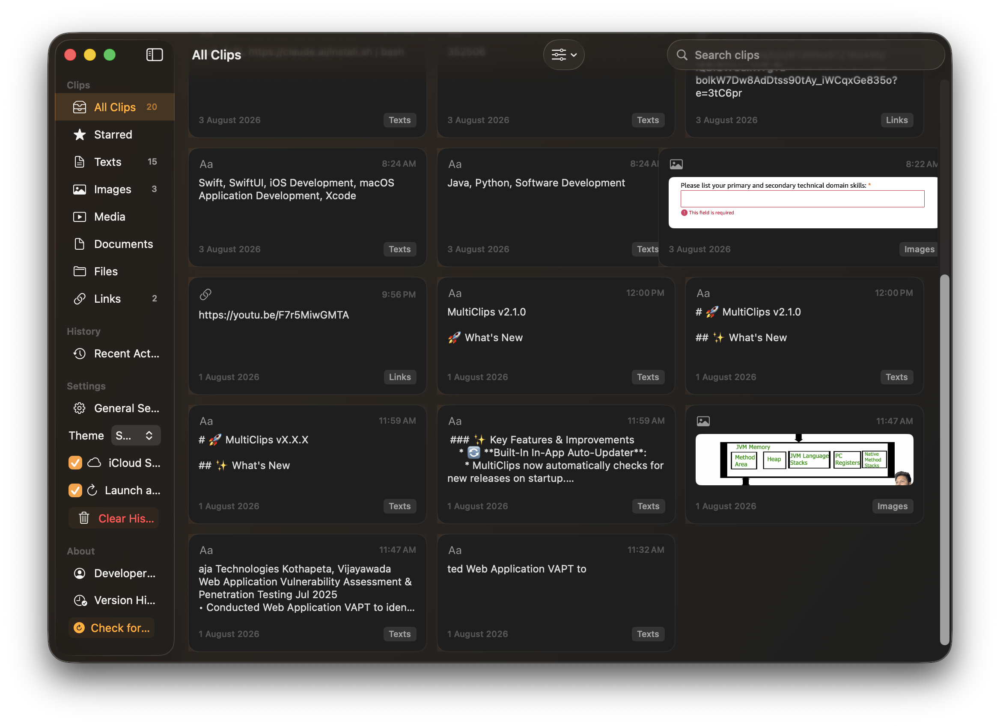
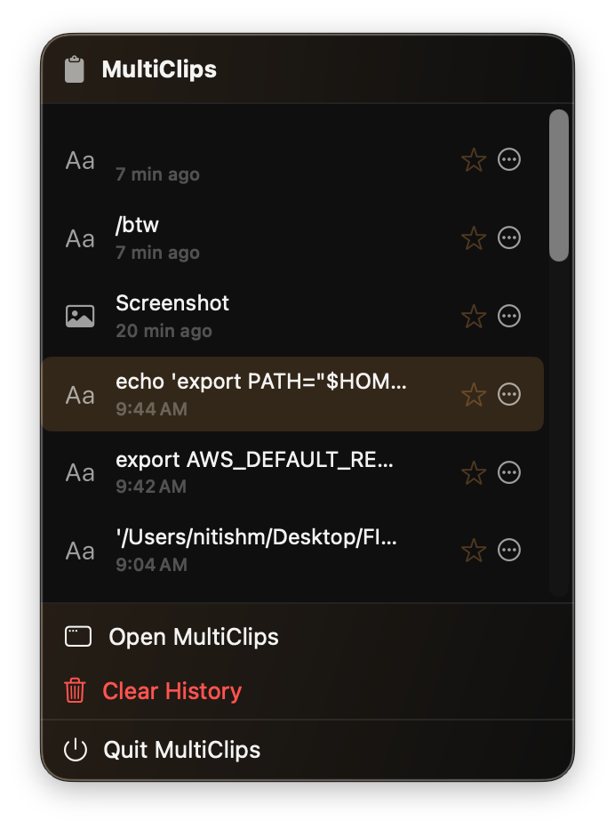

# MultiClips 📋

[](https://github.com/nitish1705/MultiClips/releases/latest)
[](LICENSE)
[](https://www.apple.com/macos)

> **Copy once, access anytime.** A lightweight, native macOS clipboard manager that never lets you lose what you copied.

MultiClips is a powerful utility that lives in your Mac's menu bar, keeping a persistent, local history of your clipboard. Built entirely with modern macOS technologies (SwiftUI and SwiftData), it is designed to be fast, private, and deeply integrated into the macOS ecosystem.

---

## 💡 Why This App Exists

By default, macOS only remembers the absolute last item you copied. If you copy a link, and then accidentally copy a piece of text right after, that original link is gone forever. 

MultiClips solves this by running silently in the background. It catches everything you copy—text, URLs, images, screenshots, and even files—and stores them in an easily searchable, beautifully designed history that you can access with a single click.

---

## ✨ Core Features

### 📋 Clipboard Management
* **Infinite Multi-Clipboard Storage:** Safely stores your entire copy history. Whether it's a snippet of code, a meme from the web, or a PDF document, MultiClips remembers it.
* **Smart Classification:** Automatically analyzes and categorizes clips into smart folders: **Texts**, **Images**, **Media**, **Documents**, **Files**, and **Links**.
* **Intelligent Duplicate Detection:** Won't clutter your history with duplicates. Recognizes exact matches and bumps them to the top of your list.
* **Rich Image Support:** Fully supports macOS screenshots (`⌘ + ⇧ + 4`), images from browsers, and files (JPG, PNG, HEIC) with beautiful thumbnail previews.

### 🔍 Search & Organization
* **Search & Live Filtering:** Instantly find past clips with real-time search that scans through all your saved content as you type.
* **Pin Clips:** Keep your most important clips easily accessible by pinning them to the top.
* **Clip Notes & Starring ⭐:** Add custom notes to clips for context. Star frequently used clips for quick access.
* **Advanced Filtering:** Filter clips by category with one-click category buttons in All Clips view.

### ⚡ Power User Features
* **Keyboard Shortcuts:** Navigate MultiClips with custom keyboard hotkeys for instant access.
* **Quick Actions:** Three-dot menu on each clip for pin, star, notes, and more.
* **Batch Operations:** Select and manage multiple clips at once.

### 🔄 Built-In Auto-Updater
* **One-Click Updates:** Never manually download updates again. MultiClips checks for new releases on launch and updates itself in seconds.
* **Changelog Preview:** See what's new before updating with in-app release notes.
* **Build Number Tracking:** Dual-versioning system ensures accurate update detection for both major releases and bug fixes.
* **Background Downloads:** Updates download in the background, then install with a single click and relaunch.
* **Learn more:** [Auto-Updater Documentation](UPDATER_GUIDE.md) | [How It Works](HOW_AUTO_UPDATE_WORKS.md)

### 🔒 Privacy & Performance
* **Uncompromising Privacy:** All data stays **strictly on your device**. Stored locally using Apple's secure SwiftData framework. Zero cloud servers, zero analytics, zero tracking.
* **Native macOS Feel:** Built from the ground up with SwiftUI. Proper dark mode, system fonts, and native materials make it feel like an official Apple app.
* **Optimized Performance:** Efficient image caching and smart rendering for smooth scrolling even with thousands of clips.

---

## 📸 Screenshots

| Main Window | Menu Bar |
|---|---|
|  |  |

---

## 🚀 Installation

### Option 1: Download the Release (Recommended)

1. Navigate to the [**Releases**](https://github.com/nitish1705/MultiClips/releases/latest) page.
2. Download the latest **MultiClips-local.dmg** file.
3. Open the downloaded `.dmg` file.
4. Drag the **MultiClips** application icon into the **Applications** folder shortcut.
5. Eject the DMG file from your desktop.
6. Launch MultiClips from your Applications folder.

**Note:** After the first install, MultiClips will auto-update itself - you'll never need to manually download a DMG again!

---

### ⚠️ Important: First Launch & macOS Gatekeeper

Because MultiClips is a free, open-source application, it is not distributed through the Mac App Store. It also hasn't been "notarized" through Apple's paid Developer Program. 

Because of this, macOS uses a security feature called **Gatekeeper** that automatically blocks apps from unidentified developers to protect your system. When you try to open MultiClips for the first time, macOS will show a warning saying the app cannot be opened. 

**This is entirely normal for open-source apps. Here is how to safely allow MultiClips to run:**

1. Open **MultiClips** from your Applications folder.
2. When the macOS warning dialog appears, click **Done** (or **Cancel**).
3. Open your Mac's **System Settings**.
4. Navigate to **Privacy & Security** in the left sidebar.
5. Scroll down to the **Security** section.
6. You will see a message stating that *"MultiClips was blocked from use because it is not from an identified developer."*
7. Click the **Open Anyway** button next to that message.
8. macOS will ask for your Mac password or Touch ID to confirm.
9. Click **Open** on the final confirmation dialog.

*MultiClips will now open normally, and macOS will remember this approval for all future launches!*

---

### Option 2: Build from Source

If you prefer to compile the app yourself, you can easily build it using Xcode.

```bash
git clone [https://github.com/nitish1705/MultiClips.git](https://github.com/nitish1705/MultiClips.git)
cd MultiClips
open MultiClips.xcodeproj
```

Then build and run from Xcode (⌘ + R).

---

## 💻 System Requirements

- **macOS**: 13.0 (Ventura) or later
- **Architecture**: Apple Silicon (M1/M2/M3) or Intel
- **Storage**: ~3 MB app size
- **Permissions**: Accessibility access (for clipboard monitoring)

---

## 📚 Documentation

- **[Auto-Updater Guide](UPDATER_GUIDE.md)** - Complete technical reference for the built-in updater system
- **[How Auto-Update Works](HOW_AUTO_UPDATE_WORKS.md)** - End-to-end explanation of the update process
- **[Release Workflow](RELEASE_WORKFLOW_EXAMPLE.md)** - Step-by-step release scenarios for contributors
- **[Quick Reference](QUICK_REFERENCE.md)** - One-page cheat sheet for developers

---

## 🤝 Contributing

Contributions are welcome! Whether it's:
- 🐛 Bug reports
- 💡 Feature requests  
- 📝 Documentation improvements
- 🔧 Code contributions

Please feel free to open an issue or submit a pull request.

### For Developers

MultiClips uses:
- **SwiftUI** for the user interface
- **SwiftData** for local persistence
- **Combine** for reactive programming
- Native **AppKit** for menu bar integration

---

## 📝 License

This project is licensed under the MIT License - see the [LICENSE](LICENSE) file for details.

---

## 🙏 Acknowledgments

Built with modern macOS technologies:
- SwiftUI for declarative UI
- SwiftData for efficient data persistence
- Apple's Clipboard API for reliable clipboard monitoring

---

## 📬 Contact & Support

- **Issues**: [GitHub Issues](https://github.com/nitish1705/MultiClips/issues)
- **Discussions**: [GitHub Discussions](https://github.com/nitish1705/MultiClips/discussions)
- **Developer**: [@nitish1705](https://github.com/nitish1705)

---

<div align="center">

**⭐ If you find MultiClips useful, consider starring the repo!**

Made with ❤️ for macOS

</div>
