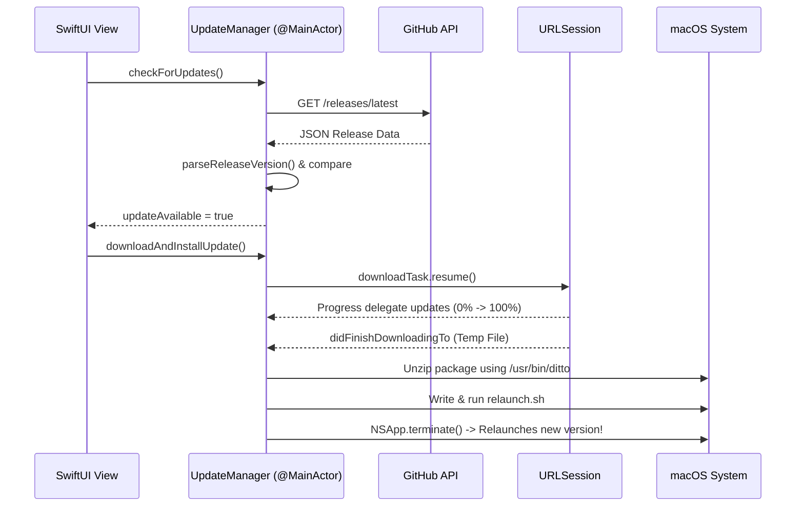

# 📚 Deep Dive: `UpdateManager.swift` Explained

This document is a comprehensive guide to understanding [`UpdateManager.swift`](file:///Users/nitishm/Desktop/FILES/Apps%20%28Xcode%29/MultiClips/MultiClips/MultiClips/UpdateManager.swift). It breaks down every Swift concept, design pattern, concurrency mechanic, and line-by-line block of logic so you can understand exactly how MultiClips checks for updates, downloads archives, and safely updates itself on macOS.

---

## 🧭 Table of Contents
1. [High-Level Architecture](#1-high-level-architecture)
2. [Imports & Modules](#2-imports--modules)
3. [Data Models (GitHub API & Versioning)](#3-data-models-github-api--versioning)
4. [The `UpdateManager` Class & Annotations](#4-the-updatemanager-class--annotations)
5. [Published UI State (`@Published`)](#5-published-ui-state-published)
6. [Bundle Version Reading](#6-bundle-version-reading)
7. [Step-by-Step Execution Flows](#7-step-by-step-execution-flows)
   - [Flow A: Checking for Updates](#flow-a-checking-for-updates)
   - [Flow B: Downloading the Release](#flow-b-downloading-the-release)
   - [Flow C: Self-Updating & Relaunching](#flow-c-self-updating--relaunching)
8. [Version Parsing & Comparison Logic](#8-version-parsing--comparison-logic)
9. [Key Swift & macOS Concepts Cheatsheet](#9-key-swift--macos-concepts-cheatsheet)

---

## 1. High-Level Architecture

`UpdateManager` is designed using the **Singleton Pattern**. It acts as a single, central manager responsible for:
1. Querying GitHub's REST API (`https://api.github.com/repos/nitish1705/MultiClips/releases/latest`).
2. Parsing JSON responses into Swift data models.
3. Comparing remote semantic versions (`v2.2-b10`) against the currently running app's `Bundle` version (`v2.2-b10`).
4. Managing background downloads using `URLSessionDownloadTask` with real-time progress tracking.
5. Extracting `.zip` release archives and executing a self-replacement script (`relaunch.sh`) to swap the running app bundle with the new binary and relaunch.



---

## 2. Imports & Modules

```swift
import Foundation
import AppKit
import SwiftUI
import Combine
```

- **`Foundation`**: Provides core networking (`URLSession`, `URLRequest`), file handling (`FileManager`), regular expressions (`NSRegularExpression`), and JSON encoding/decoding.
- **`AppKit`**: The underlying macOS UI framework. Used for `NSWorkspace.shared.open(webURL)` (to open URLs in Safari) and `NSApp.terminate(nil)` (to quit the app).
- **`SwiftUI`**: Required for `@MainActor` and binding state with SwiftUI components.
- **`Combine`**: Provides `ObservableObject` and `@Published`, allowing SwiftUI views to automatically redraw when state changes.

---

## 3. Data Models (GitHub API & Versioning)

### A. `GitHubRelease` & `GitHubAsset`
```swift
struct GitHubRelease: Codable, Identifiable { ... }
struct GitHubAsset: Codable, Identifiable { ... }
```

- **`Codable`**: A Swift protocol alias (`Decodable & Encodable`). It allows Swift's `JSONDecoder` to automatically map JSON keys from GitHub's API response directly into Swift properties.
- **`CodingKeys`**: Custom enum mapping GitHub's `snake_case` JSON keys (e.g., `tag_name`, `browser_download_url`) to Swift's idiomatic `camelCase` properties (`tagName`, `browserDownloadUrl`).
- **`Identifiable`**: Conformance providing a unique `id` property, making it compatible with SwiftUI `ForEach` loops and list views.

### B. `AppVersionInfo`
```swift
struct AppVersionInfo: Equatable {
    let versionComponents: [Int] // e.g. [2, 2, 0]
    let buildNumber: Int         // e.g. 10
    let rawVersionString: String // e.g. "2.2"

    var displayString: String {
        "v\(rawVersionString) (Build \(buildNumber))"
    }
}
```
A type-safe representation of an app version. MultiClips uses a **dual-versioning system**:
1. **Marketing Version**: Major release numbers (`2.2`).
2. **Build Number**: Incremental build counter (`Build 10`).

---

## 4. The `UpdateManager` Class & Annotations

```swift
@MainActor
final class UpdateManager: NSObject, ObservableObject, URLSessionDownloadDelegate {
    static let shared = UpdateManager()
```

- **`@MainActor`**: Guarantees that all properties and methods inside `UpdateManager` are bound to the **Main Thread**. In SwiftUI, modifying published properties on background threads causes UI glitches or crashes. `@MainActor` prevents threading bugs at compile-time.
- **`final class`**: Prevents subclassing, allowing the Swift compiler to optimize method dispatching.
- **`NSObject`**: Inherited from Objective-C's root class. Required because `URLSessionDownloadDelegate` is an Objective-C protocol.
- **`ObservableObject`**: Allows SwiftUI views (`@ObservedObject` or `@StateObject`) to listen for changes.
- **`URLSessionDownloadDelegate`**: Protocol that provides callbacks when file downloads progress or complete.
- **`static let shared`**: Singleton instance ensuring only one update manager exists in memory.

---

## 5. Published UI State (`@Published`)

```swift
@Published var isChecking: Bool = false
@Published var updateAvailable: Bool = false
@Published var latestRelease: GitHubRelease? = nil
@Published var latestVersionInfo: AppVersionInfo? = nil
@Published var downloadProgress: Double = 0.0
@Published var isDownloading: Bool = false
@Published var isInstalling: Bool = false
@Published var errorMessage: String? = nil
@Published var upToDateMessageShown: Bool = false
```

Whenever any of these properties are mutated, Combine fires an update notification (`objectWillChange`), telling all connected SwiftUI views (like `UpdateBannerView`) to immediately re-render themselves.

---

## 6. Bundle Version Reading

```swift
var currentVersion: String {
    Bundle.main.infoDictionary?["CFBundleShortVersionString"] as? String ?? "2.0.0"
}

var currentBuildNumber: Int {
    let buildStr = Bundle.main.infoDictionary?["CFBundleVersion"] as? String ?? "1"
    return Int(buildStr.trimmingCharacters(in: .whitespacesAndNewlines)) ?? 1
}
```

- **`Bundle.main`**: Accesses the compiled macOS app bundle and reads metadata stored in `Info.plist`.
- **`CFBundleShortVersionString`**: The marketing version string (e.g. `"2.2"`).
- **`CFBundleVersion`**: The project build number (e.g. `"10"`).

---

## 7. Step-by-Step Execution Flows

### Flow A: Checking for Updates

Method: `checkForUpdates(isManualCheck: Bool)`

1. **Guard Clause**:
   ```swift
   guard !isChecking && !isDownloading else { return }
   ```
   Prevents redundant API requests if a check or download is already running.

2. **Construct Request**:
   - URL: `https://api.github.com/repos/nitish1705/MultiClips/releases/latest`
   - Headers: Sets `Accept` to GitHub v3 JSON API and custom `User-Agent`.
   - Timeout: 15 seconds.

3. **Asynchronous Network Call (`async/await`)**:
   ```swift
   Task { @MainActor in
       let (data, response) = try await URLSession.shared.data(for: request)
   ```
   Executes the HTTP fetch asynchronously without blocking the UI thread. The response is validated for HTTP status 200.

4. **JSON Decoding & Comparison**:
   - `JSONDecoder().decode(GitHubRelease.self, from: data)` parses the raw bytes into a `GitHubRelease` object.
   - `parseReleaseVersion` parses remote tag (`v2.2-b10`) into an `AppVersionInfo`.
   - `isUpdateNewer(remote:local:)` evaluates if the remote release is newer than the local build.

---

### Flow B: Downloading the Release

Methods: `downloadAndInstallUpdate()`, `cancelDownload()`, and Delegate Callbacks

1. **Asset Selection**:
   ```swift
   guard let zipAsset = release.assets.first(where: { $0.name.lowercased().hasSuffix(".zip") }) ...
   ```
   Searches the GitHub release assets for `.zip` (preferred for auto-updating) or `.dmg`. Fallback opens the web browser if no archive asset is attached.

2. **Delegate-based Download Session**:
   ```swift
   let session = URLSession(configuration: .default, delegate: self, delegateQueue: .main)
   downloadTask = session.downloadTask(with: downloadURL)
   downloadTask?.resume()
   ```
   Downloads the file using delegate callbacks to track progress:
   - **Progress Callback (`didWriteData`)**:
     ```swift
     nonisolated func urlSession(_ session: URLSession, downloadTask: URLSessionDownloadTask, didWriteData...) {
         let progress = Double(totalBytesWritten) / Double(totalBytesExpectedToWrite)
         Task { @MainActor in self.downloadProgress = progress }
     }
     ```
     Calculates percentage `0.0 ... 1.0` and updates `downloadProgress` on the `@MainActor`. `nonisolated` explicitly opts out of `@MainActor` enforcement because Objective-C delegate callbacks are triggered on background session queues.

---

### Flow C: Self-Updating & Relaunching

Methods: `urlSession(... didFinishDownloadingTo:)` & `installUpdate(...)`

Once the download finishes, macOS saves the temporary file to a sandbox cache path. `UpdateManager` processes it as follows:

1. **Move Temp File**: Moves the downloaded update to a unique working folder in `FileManager.default.temporaryDirectory`.
2. **Unzip Binary (`Process` & `ditto`)**:
   ```swift
   let unzipProcess = Process()
   unzipProcess.executableURL = URL(fileURLWithPath: "/usr/bin/ditto")
   unzipProcess.arguments = ["-x", "-k", packageURL.path, extractedAppDir.path]
   try unzipProcess.run()
   unzipProcess.waitUntilExit()
   ```
   Uses macOS's native `/usr/bin/ditto` command line utility to safely unzip the application package into `Extracted/MultiClips.app`.

3. **Generate Relaunch Script (`relaunch.sh`)**:
   To replace an app binary that is currently running, macOS requires the process to exit first. `UpdateManager` writes a shell script (`relaunch.sh`):
   ```bash
   #!/bin/bash
   sleep 1
   rm -rf "/Applications/MultiClips.app"
   cp -R "/tmp/.../Extracted/MultiClips.app" "/Applications/MultiClips.app"
   xattr -dr com.apple.quarantine "/Applications/MultiClips.app" 2>/dev/null || true
   open "/Applications/MultiClips.app"
   ```
   - `sleep 1`: Gives the running instance time to quit cleanly.
   - `rm -rf` & `cp -R`: Overwrites the old app bundle with the extracted new version.
   - `xattr -dr com.apple.quarantine`: Strips Gatekeeper quarantine attributes from downloaded zips to prevent *"App downloaded from internet"* popup blocks.
   - `open`: Launches the updated app bundle.

4. **Execute Relaunch Script & Quit App**:
   ```swift
   let relaunchProcess = Process()
   relaunchProcess.executableURL = URL(fileURLWithPath: "/bin/bash")
   relaunchProcess.arguments = [scriptPath]
   try relaunchProcess.run()

   NSApp.terminate(nil) // Quits current running app
   ```

---

## 8. Version Parsing & Comparison Logic

### Parsing Regex Patterns

1. **Tag Pattern**: `(?i)^([0-9\.]+)[-_\+](?:b|build)?\s*([0-9]+)$`
   - Handles tags like: `v2.2-b10`, `v2.0-b7`, `v2.1+9`.
   - **Group 1**: Captures marketing version (`"2.2"`).
   - **Group 2**: Captures build number (`10`).

2. **Body Fallback Pattern**: `(?i)\bbuild\s*(?:number|num)?\s*:?\s*([0-9]+)`
   - If the git tag lacks a build number (e.g. tag is plain `v2.0`), it inspects the GitHub Release body text for phrasings like `"Build 10"`, `"Build Number: 10"`, or `"build: 10"`.

### Comparison Logic (`isUpdateNewer`)

```swift
func isUpdateNewer(remote: AppVersionInfo, local: AppVersionInfo) -> Bool
```
Compares versions using a strict 2-tier evaluation:
1. **Component-by-Component Check**: Normalizes versions to 3 integer array slots (`"2.2"` -> `[2, 2, 0]`). Iterates through index `0..2`:
   - If `remote[i] > local[i]`, returns `true` (Update Available).
   - If `remote[i] < local[i]`, returns `false` (Current build is newer).
2. **Build Number Tiebreaker**: If all marketing components match (`2.2 == 2.2`), evaluates build numbers:
   - Returns `remote.buildNumber > local.buildNumber`.

---

## 9. Key Swift & macOS Concepts Cheatsheet

| Swift / macOS Keyword | Purpose in `UpdateManager.swift` |
| :--- | :--- |
| **`@MainActor`** | Annotates classes/methods to run strictly on the main thread (prevents UI thread bugs). |
| **`ObservableObject`** | Swift protocol that broadcasts property changes to connected SwiftUI views. |
| **`@Published`** | Property wrapper that automatically notifies subscribers when values change. |
| **`nonisolated`** | Opts out of `@MainActor` for Objective-C delegate methods called on background threads. |
| **`Process()`** | Native Foundation API to run system shell commands (`ditto`, `chmod`, `bash`). |
| **`URLSession`** | Asynchronous HTTP networking engine for fetching JSON and downloading files. |
| **`xattr`** | macOS terminal utility used to remove Gatekeeper quarantine flags from downloaded binaries. |
| **`NSApp.terminate()`** | Gracefully quits the current macOS application instance. |
